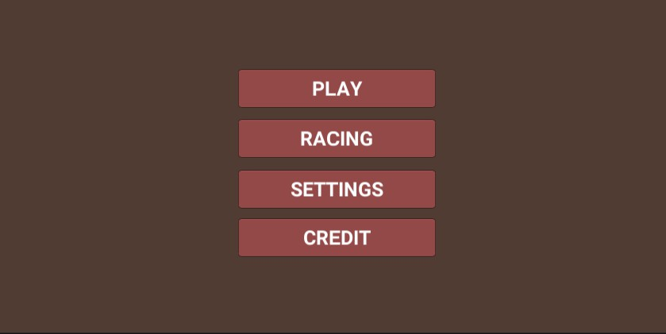
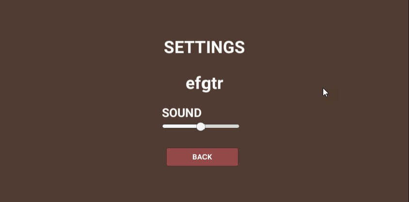
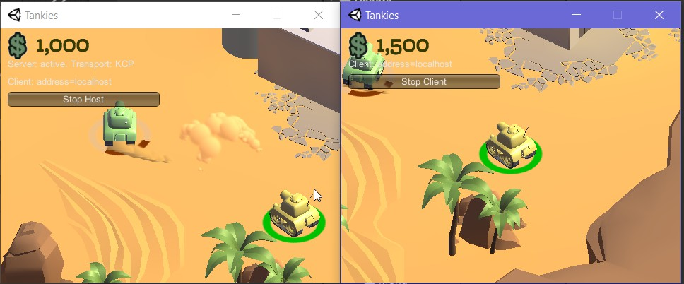
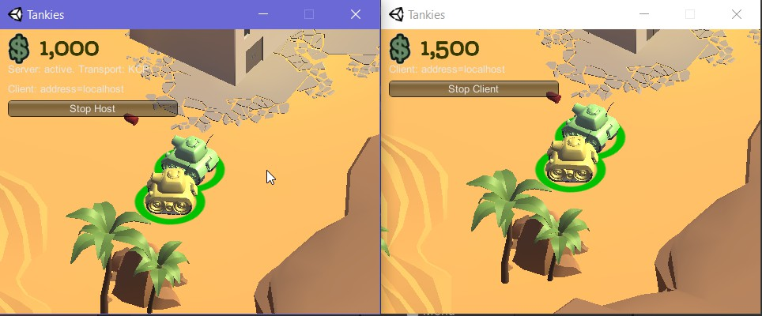
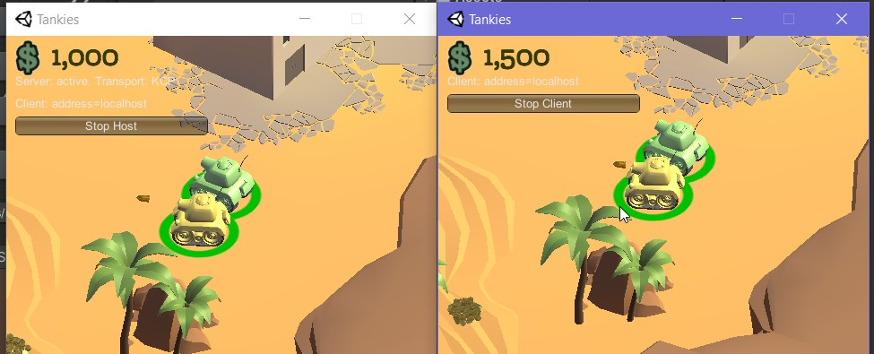
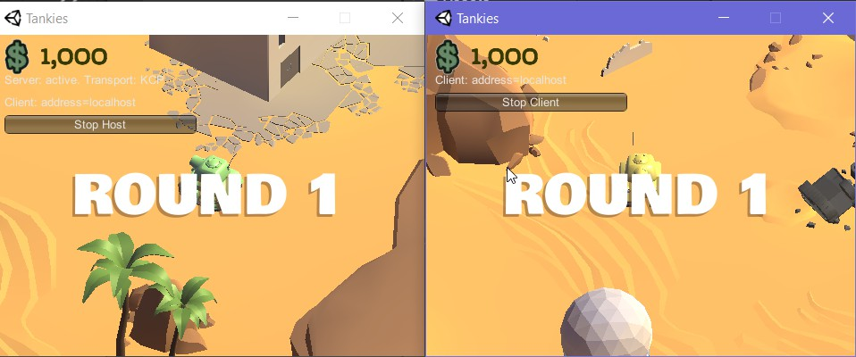
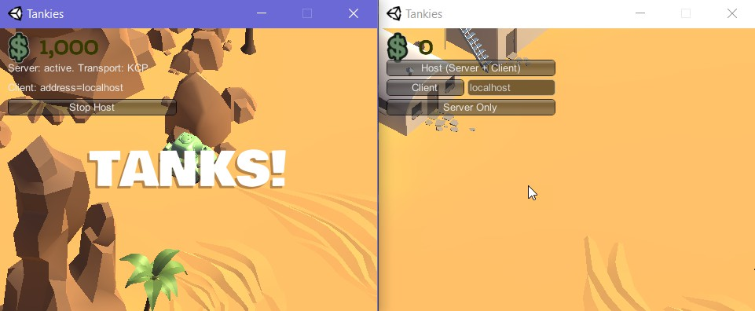
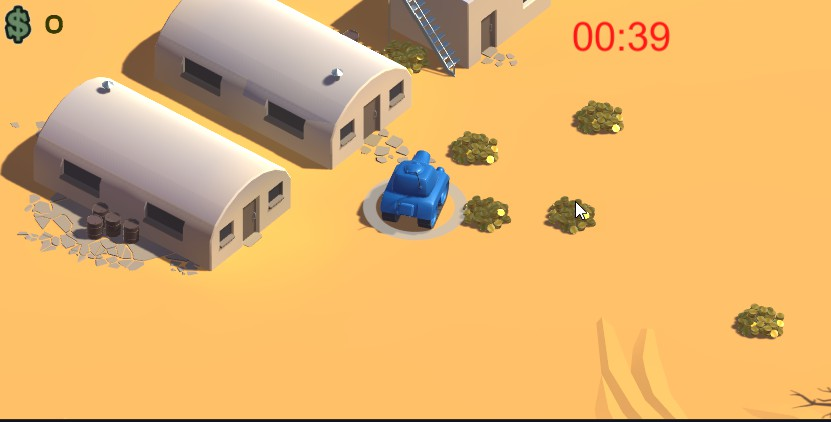
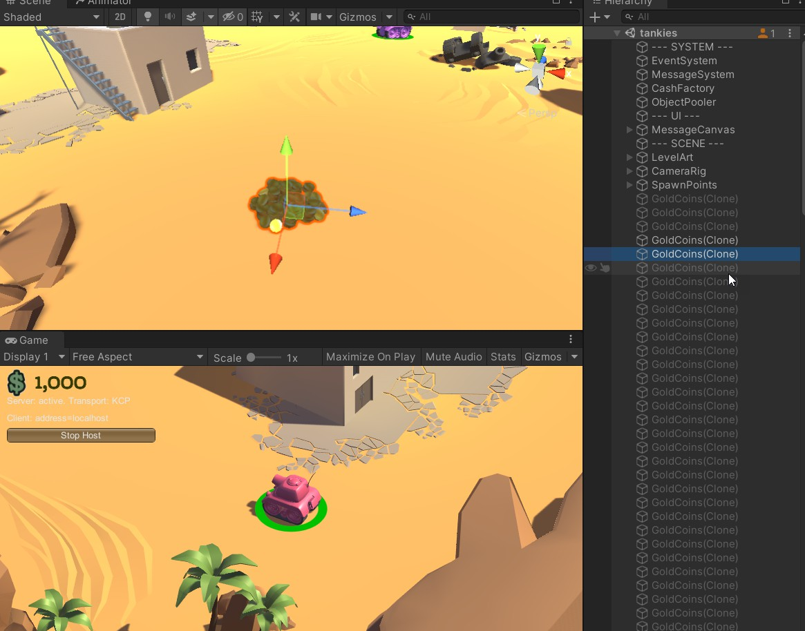

# IF3210-2021-Unity-K02-05

## Deskripsi Aplikasi

Aplikasi awalnya bertampilan Main menu dengan 4 tombol:

### Game

- Multiplayer Tanks! yang dapat dijalankan pada Local Area Network (LAN) dengan 4 pemain. Matchmaking lobby.
- Objek cash yang muncul secara periodik dan acak.
- Ada karakter teranimasi yang dapat dikeluarkan dengan membayar cash.
- Terdapat pembelian senjata

### Racing

- Game mode **Time Money Racing** secara MonoBehavior (non-multiplayer)

#### Settings

- Mengatur intensitas suara

#### Credit

- Penulisan aset tambahan (Unity-Chan dan GoldCoins) dan kontributor

### How to play:

1. Pada main menu, pilih ingin bermain Multiplayer (tekan **Game**) atau ingin bermain Time-Money Survival (tekan **Racing**)
2. Pada **Game**, tekan host untuk menjadi server (Create room) atau masuk ke room dengan hostname temanmu (Join room)
3. Game started!

## Cara kerja

## Screenshot

Base menu

Settings

Credits

Lobby Multiplayer

Multiplayer 1

Multiplayer 2

Multiplayer 3

Multiplayer 4

Multiplayer 5

Multiplayer Interaction 1

Multiplayer Interaction 2

Time-Money Survival

Gold Coins

## Library yang digunakan

## Pembagian kerja anggota kelompok

1. Iqbal Naufal 13518074

- Animation
- Pembelian senjata

2. Jones Napoleon Autumn 13518086

- Racing
- Main menu, Scening, Settings, Credit

3. Faris Rizki Ekananda 13518125

- Multiplayer
- Cash
