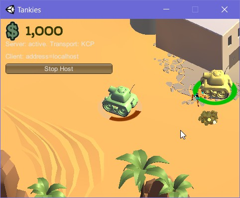
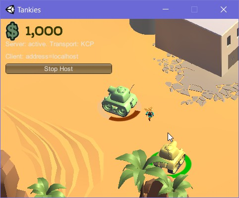

# IF3210-2021-Unity-K02-05

## Deskripsi Aplikasi

Aplikasi awalnya bertampilan Main menu dengan 4 tombol:

### Game

- Multiplayer Tanks! yang dapat dijalankan pada Local Area Network (LAN) dengan 4 pemain. Matchmaking lobby.
- Objek cash yang muncul secara periodik dan acak.
- Ada karakter teranimasi yang dapat dikeluarkan dengan membayar cash.
- Terdapat pembelian senjata

### Racing

- Game mode **Time Money Racing** secara MonoBehavior (non-multiplayer)

#### Settings

- Mengatur intensitas suara

#### Credit

- Penulisan aset tambahan (Unity-Chan dan GoldCoins) dan kontributor

### How to play:

1. Pada main menu, pilih ingin bermain Multiplayer (tekan **Game**) atau ingin bermain Time-Money Survival (tekan **Racing**)
2. Pada **Game**, tekan host untuk menjadi server (Create room) atau masuk ke room dengan hostname temanmu (Join room)
3. Game started!

## Cara kerja

### Multiplayer (local area network)
- Pertama memilih instansi game yang mana yang menjadi host dan yang mana menjadi client. Server digunakan untuk mensinkronisasi posisi antar instansi tank dan mengontrol objek-objek selain tank sehingga muncul secara real-time pada host dan client.

### Main Menu
- Terdapat pilihan untuk bermain secara normal (battle royale), bermain secara time-money, settings yang digunakan untuk mengganti volume suara dengan menggunakan audio source

### Cash
- Terdapat objek cash yang muncul pada map secara random dan periodik. Jika tank berjalan melewati objek tersebut, cash yang dimiliki oleh tank akan bertambah

### Senjata
- Terdapat dua jenis peluru dari tank yang memiliki karakteristik dan penampilan yang berbeda

### Karakter
- Terdapat satu jenis karakter dari tank yang dapat dimunculkan dari tank.

### Animasi Karakter
- Karakter dapat bergerak dengan animasi

### Aset tambahan
- Aset tambahan yang digunakan dapat dilihat pada bagian justifikasi library yang digunakan.

## Screenshot

Base menu

Settings

Credits

Lobby Multiplayer

Multiplayer 1

Multiplayer 2

Multiplayer 3

Multiplayer 4

Multiplayer 5

Multiplayer Interaction 1

Multiplayer Interaction 2

Time-Money Survival

Gold Coins

## Library yang digunakan

- Mirror library, link="https://mirror-networking.com/" untuk menyediakan koneksi antara dua instansi atau lebih game sehingga dapat melakukan multiplayer.

## Assets yang digunakan

- Gold Coins, link="https://assetstore.unity.com/packages/3d/props/gold-coins-1810" untuk menyediakan model dan animasi dari object cash yang dapat dikumpulkan oleh tank.

- Unity-Chan!, link="https://assetstore.unity.com/packages/3d/characters/unity-chan-model-18705#description" untuk menyediakan model dan animasi dari object karakter yang dapat dimunculkan oleh tank.

## Pembagian kerja anggota kelompok

1. Iqbal Naufal 13518074

- Animation
- Pembelian senjata

2. Jones Napoleon Autumn 13518086

- Racing
- Main menu, Scening, Settings, Credit

3. Faris Rizki Ekananda 13518125

- Multiplayer
- Cash
